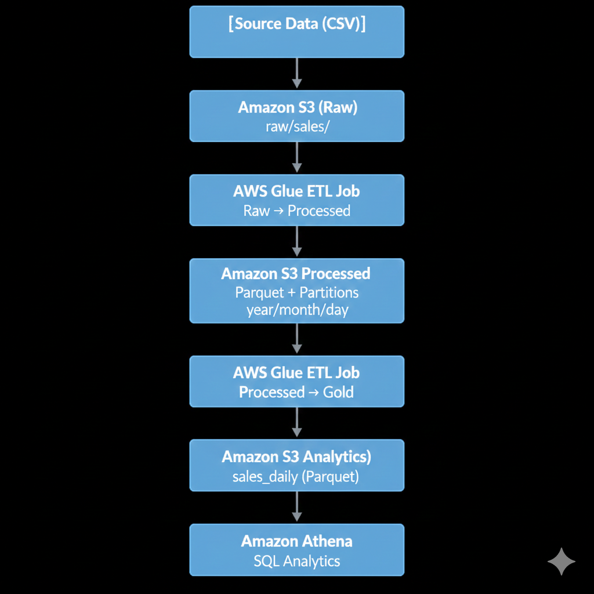
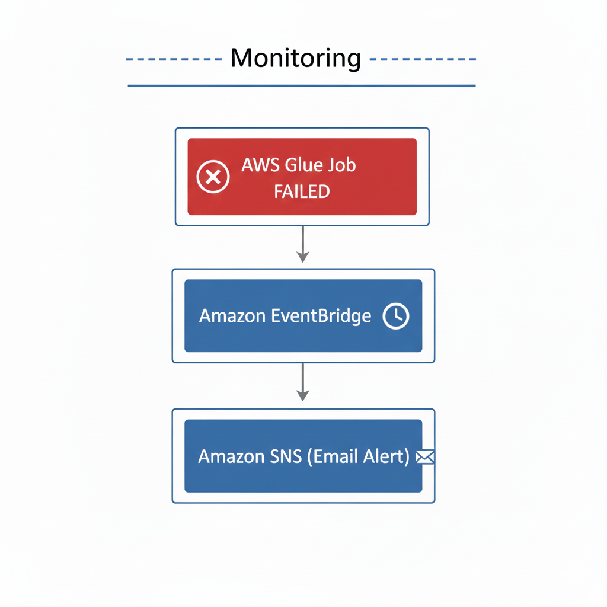
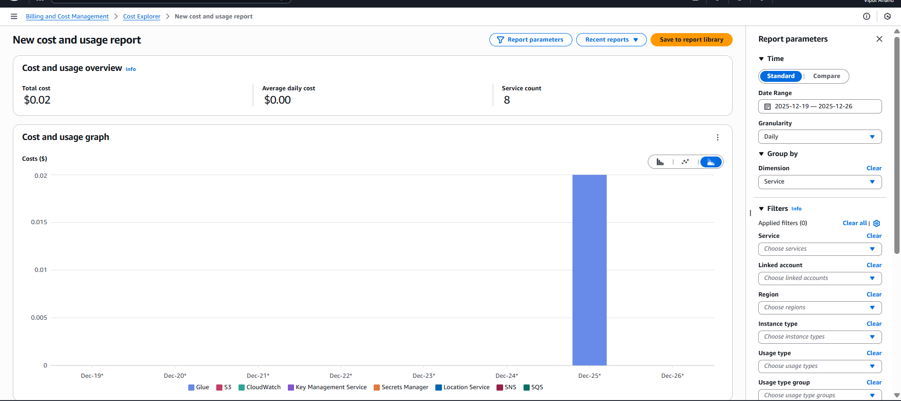

# AWS Production Data Lake – End-to-End Data Engineering Project

## 📌 Overview

This project demonstrates a **production-style AWS data lake** built using **Amazon S3, AWS Glue, Athena, EventBridge, and SNS**, with a strong focus on **cost efficiency**, **incremental ETL**, and **analytics-ready data modeling**.

The pipeline ingests raw sales data, transforms it into optimized Parquet datasets, creates analytics-ready aggregates, and enables SQL-based analysis using Athena. Monitoring is implemented using **event-driven failure alerts**.

This project reflects **real-world data engineering practices** suitable for a **2+ years Data Engineer** role.

---

## 🏗️ Architecture




### High-level flow

1. Raw CSV data lands in **Amazon S3 (Raw zone)**
2. **AWS Glue ETL** cleans and converts data into **Parquet**, partitioned by date
3. Transformed data is stored in **S3 Processed zone**
4. A second **Glue Analytics job** creates daily aggregates (Gold layer)
5. Aggregated data is stored in **S3 Analytics zone**
6. **Amazon Athena** queries analytics data efficiently
7. **Amazon EventBridge + SNS** send email alerts on Glue job failures
8. (Optional) **AWS Lambda** can trigger Glue on new data arrival (disabled after demo)

---

## 🧰 Tech Stack

* **Amazon S3** – Data lake storage (Raw, Processed, Analytics)
* **AWS Glue (PySpark)** – ETL and analytics jobs
* **AWS Glue Data Catalog** – Schema and metadata management
* **Amazon Athena** – Serverless SQL analytics
* **Amazon EventBridge** – Event-driven monitoring
* **Amazon SNS** – Email notifications
* **AWS Lambda** – Automation trigger (disabled post-demo)

---

## 📂 Data Lake Structure

```
s3://aws-prod-data-lake-2025/
├── raw/
│   └── Sales/
├── processed/
│   └── sales/
│       └── year=YYYY/month=MM/day=DD/
├── Analytics/
│   └── sales_daily/
│       └── year=YYYY/month=MM/
└── error/
```

---

## 🔄 ETL Workflow

### 1️⃣ Raw → Processed (Incremental ETL)

* Reads CSV files from `raw/sales/`
* Applies schema casting and basic data quality checks
* Writes **Parquet** files partitioned by `year/month/day`
* Uses **Glue job bookmarks** for incremental processing

📄 Script: `glue_jobs/raw_to_processed.py`

---

### 2️⃣ Processed → Analytics (Gold Layer)

* Reads processed Parquet data
* Aggregates **daily sales metrics**
* Outputs analytics-ready Parquet datasets

📄 Script: `glue_jobs/processed_to_analytics.py`

---

## 📊 Analytics with Athena

Example query on analytics dataset:

```sql
SELECT
  year,
  month,
  day,
  total_orders,
  total_revenue
FROM sales_daily;
```

* Partition filters ensure **minimal data scanned**
* Suitable for dashboards and BI tools

---

## 🚨 Monitoring & Alerts

* **Amazon EventBridge** listens to Glue job state-change events
* Triggers only on **FAILED** job state
* Sends email notifications via **SNS**
* Avoids CloudWatch metric delays and false alerts

---

## 💰 Cost Awareness

This project is designed to stay **within AWS Free Tier / minimal cost**:

* Small datasets (KB–MB scale)
* Parquet format + partition pruning
* On-demand Glue jobs only
* No always-running compute
* Event-driven monitoring

**Observed cost during testing:** ~$0.02 USD (Glue only)


---

## 📁 Repository Structure

```
aws-production-data-lake/
├── glue_jobs/
├── lambda/
├── athena_queries/
├── sample_data/
├── architecture/
├── screenshots/
└── README.md
```

---

## 🧪 How to Reproduce

1. Create an S3 bucket and base folders
2. Upload sample data to `raw/sales/`
3. Run Glue ETL job (Raw → Processed)
4. Run Glue Analytics job (Processed → Analytics)
5. Create Glue Crawlers and query data using Athena
6. Configure EventBridge rule for Glue job failure alerts

---

## 🎯 What This Project Demonstrates

* Layered data lake design (Raw / Processed / Analytics)
* Incremental ETL with Glue bookmarks
* Parquet optimization and partitioning
* Cost-efficient AWS architecture
* Event-driven monitoring
* Production-ready data engineering practices

---

## 👤 Author

**Vipul Anand**
Data Engineer
📍 Pune, India

